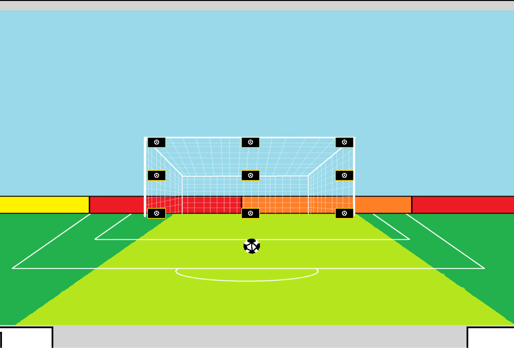
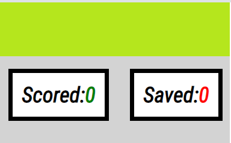
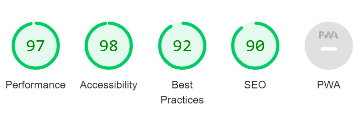
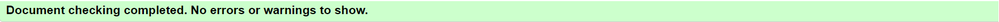
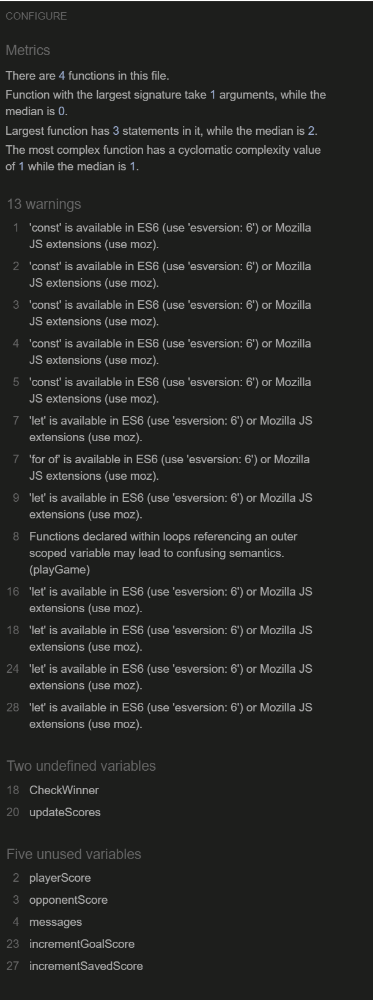
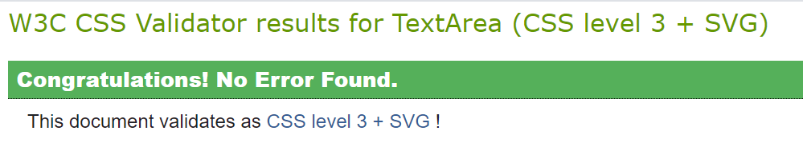

## Penalty Shootout

This randomised penalty shootout game, that is targeted towards both adults and children, gives the users to the ability test their decision-making skills. As one of, if not the biggest sport in the world football is a high-performance game, testing not only endurance and physical abilities but mental too. Penalties are incredibly high-pressured situations that require strong will, technique and a bit of luck.
Although nothing is really on the line here, users that play this game will be gain a small understanding of those situations and can take those newfound or strengthened decision making skills to other parts of their lives. When choosing an option from the interactive buttons another option will be randomly selected and if they match, the penalty will be saved, if not then it will be a goal.

# -Features

# Header:

- The header stands out against the background and clearly stating what the game is about.
  

# Game Options:

- A layout of 9 buttons across the front of a goal, giving the user multiple options from interactive buttons to make their choice.
  

# Game Results:

- Once and option is chosen then the JavaScript code will choose a random option for the opposition, then determining who gets the point.
- The results are situated at the bottom of the screen in to clear and distinctive sections, making it easy to understand.

  

# -Features left to implement

- Feature needed is the games ability to select an option from the buttons available, then have a random picked out. If they matched it would mean a save and added to the save side. If the mismatched then it would be a goal and added to the scored side.

# -Testing

- The game was tested in different browsers: Chrome, Microsoft Edge.
- Results from the game are always correct.
- All content is easily readable and understandable.
- Lighthouse Results show that the stylings chosen are easy to read.
  

## Bugs-

## Validator Testing-

- Html – Errors - No Errors came back from the [W3C validator](https://validator.we.org/)
  

  JShint- Several warning but no errors in [JShint validator](https://jshint.com/)
  

CSS –[W3C validator] (https://jigsaw.w3.org/css-validator/)

# Deployment-

The game was deployed to GitHub pages.

# Credits-

## Content-

- To apply the buttons to the image [W3Schools](https://W3School.com)
- The template for my coding was as a guide through [Code Institute](https://codeinstitute.net)
- I got help from both my mentor and other students on [Slack](https://slack.com)

## Media-

- Icons for buttons the buttons were taken from [FontAwesome](https://fontawesome.com/)
- The main image was created by me through the Paint app.
- Podcasts were used as extra learning on things that wasnt clear to me through [Spotify](https://spotify.com>)
